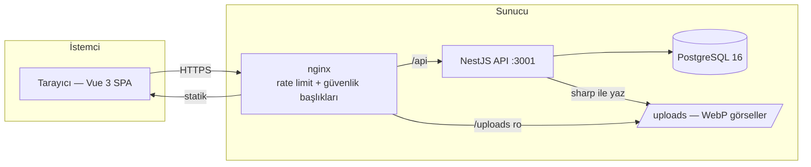
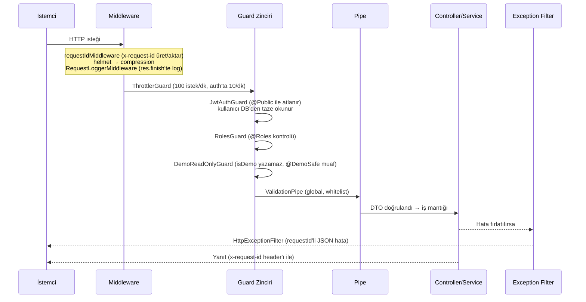
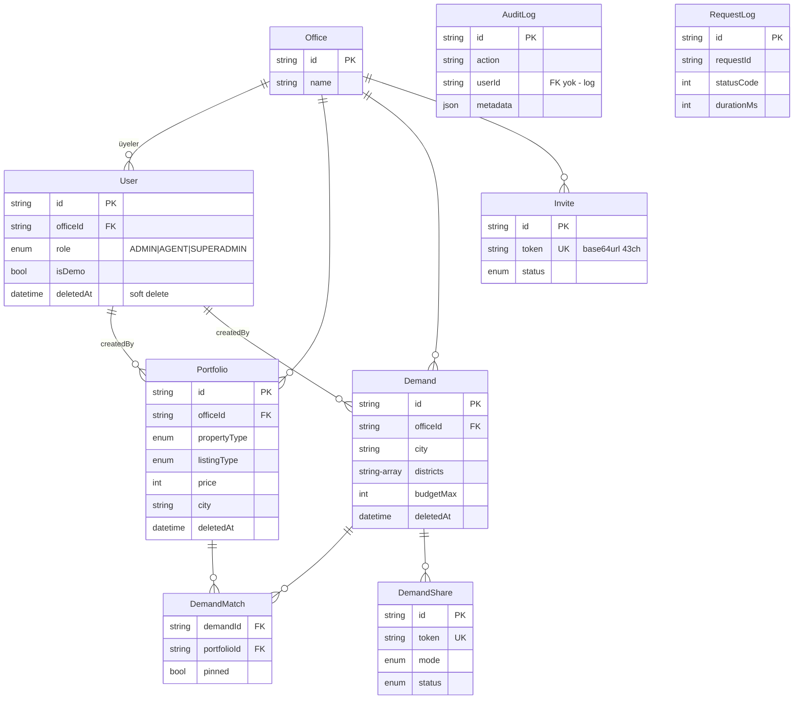

# EstateDesk (emlakdefter) — Mimari Dokümantasyonu


> dokümandan kodu takip edebilmesi için yazılmıştır. Her bölüm ilgili dosya/klasöre
> işaret eder. Güncel tutulması beklenir: yeni bir modül eklendiğinde
> [Yeni Domain Checklist](#yeni-domain-checklist)'i uygulayın ve bu dokümanı güncelleyin.

## İçindekiler

1. [Genel Bakış](#genel-bakış)
2. [Depo Yerleşimi](#depo-yerleşimi)
3. [İstek Yaşam Döngüsü](#istek-yaşam-döngüsü)
4. [Backend Modül Rehberi](#backend-modül-rehberi)
5. [Veri Modeli](#veri-modeli)
6. [Eşleştirme Motoru](#eşleştirme-motoru)
7. [Denetim ve Loglama](#denetim-ve-loglama)
8. [Süper Admin Paneli](#süper-admin-paneli)
9. [Frontend Mimarisi](#frontend-mimarisi)
10. [Konvansiyonlar](#konvansiyonlar)
11. [Yeni Domain Checklist](#yeni-domain-checklist)
12. [Neden Mikroservis Değil?](#neden-mikroservis-değil)

---

## Genel Bakış

EstateDesk, Türk emlak ofisleri için **çok kiracılı (multi-tenant)** bir portföy ve
talep yönetim SaaS'ıdır. Temel vaat: portföyler ile müşteri talepleri arasında
çift yönlü, ağırlıklı eşleştirme yaparak unutulan fırsatları ortadan kaldırmak.

**Stack:** NestJS 10 (TypeScript) · Vue 3 + Vite + Pinia · PostgreSQL 16 + Prisma 5 ·
Docker Compose · nginx (prod reverse proxy)

**Mimari stil:** Modüler monolit. Her domain kendi NestJS modülünde izole;
modüller arası iletişim doğrudan servis enjeksiyonuyla yapılır
(bkz. [Neden Mikroservis Değil?](#neden-mikroservis-değil)).



## Depo Yerleşimi

```
estateDesk/
├── backend/               # NestJS API
│   ├── prisma/            # schema.prisma, migration'lar, seed script'leri
│   └── src/
│       ├── admin/         # Süper admin API'si (SUPERADMIN rolü)
│       ├── audit/         # Denetim kaydı + istek log yazıcı + retention cron (@Global)
│       ├── auth/          # JWT login/register/demo/logout
│       ├── common/        # Guard, decorator, util, middleware, filter, pipe
│       ├── dashboard/     # Özet istatistikler
│       ├── demand/        # Alıcı talepleri (CRUD)
│       ├── demand-match/  # Talep ↔ portföy pin/kayıt tablosu
│       ├── demand-share/  # Token'lı public "defter" paylaşımı
│       ├── health/        # Docker/Plesk healthcheck endpoint'i
│       ├── matching/      # Ağırlıklı eşleştirme motoru
│       ├── office/        # Ofis CRUD + üyelik + davet yaşam döngüsü
│       ├── portfolio/     # Mülk ilanları (CRUD + görsel yükleme)
│       ├── prisma/        # PrismaService (global)
│       ├── search/        # Global arama (trigram indeksli raw SQL)
│       └── users/         # Profil + ofis kapsamlı kullanıcı yönetimi
├── frontend/
│   ├── public/            # favicon seti, robots.txt, sitemap.xml, webmanifest
│   └── src/
│       ├── admin/         # İZOLE süper admin paneli (bkz. src/admin/README.md)
│       ├── components/    # Paylaşılan UI bileşenleri (ui/, layout/)
│       ├── composables/   # useAsync, useCurrencyInput, useToast, useConfirm…
│       ├── data/          # tr-locations (81 il/ilçe/mahalle)
│       ├── router/        # Route tanımları + auth guard'ları + dinamik title
│       ├── services/      # api.ts (tekil Axios instance)
│       ├── stores/        # Pinia (auth)
│       ├── types/         # Domain TS tipleri
│       └── views/         # Sayfa bileşenleri (domain klasörlü)
├── nginx/                 # prod.conf (rate limit, güvenlik başlıkları)
├── scripts/               # generate-icons.mjs, fetch-district-coords.mjs
├── docs/                  # Bu doküman + ROADMAP + eşleştirme yol haritası
├── docker-compose.yml     # Dev stack (hot reload)
└── docker-compose.prod.yml# Prod stack (healthcheck'li)
```

## İstek Yaşam Döngüsü

Bir HTTP isteği API'ye ulaştığında sırasıyla şu katmanlardan geçer.
Sıralama `backend/src/main.ts` ve `backend/src/app.module.ts`'te tanımlıdır:



Bilinmesi gereken kritik noktalar:

- **JWT payload'ı minimaldir** (`sub`, `email`, `role`); kullanıcı **her istekte**
  DB'den taze okunur (`auth/jwt.strategy.ts → validate()`). Bu sayede rol
  değişikliği/deaktivasyon anında etki eder. Controller'lara `@CurrentUser()`
  decorator'ı ile enjekte edilir.
- **Ofis izolasyonu guard'da değil, servis katmanındadır:** her sorgu
  `officeId` ile filtrelenir; `common/office.util.ts → requireOfficeId()`
  ofissiz kullanıcıyı reddeder. Yeni endpoint yazarken bu filtreyi unutmak
  en tehlikeli hatadır.
- Global guard sırası `app.module.ts`'te `APP_GUARD` provider'larının
  **tanımlanma sırasıyla** belirlenir.

## Backend Modül Rehberi

Her modül standart NestJS yapısındadır: `*.module.ts` (bağımlılıklar),
`*.controller.ts` (ince — sadece HTTP eşleme), `*.service.ts` (iş mantığı),
`dto/` (doğrulama). Aşağıdaki tablolar endpoint envanteridir.

### auth (`src/auth/`)

Kimlik doğrulama. Login'de kullanıcı bulunamasa bile sahte bcrypt karşılaştırması
yapılır (timing tabanlı e-posta enumeration koruması — `auth.service.ts` başındaki
`DUMMY_PASSWORD_HASH`). Tüm auth olayları denetim kaydına düşer.

| Method | Path | Açıklama |
|---|---|---|
| POST | `/auth/login` | JWT üretir (12 saat); başarısız deneme de loglanır |
| POST | `/auth/register` | Yeni kullanıcı (ofissiz başlar → onboarding) |
| POST | `/auth/demo` | Salt-okunur demo oturumu (`isDemo`) |
| GET | `/auth/me` | Token'daki kullanıcının taze profili |
| POST | `/auth/logout` | Yalnızca denetim kaydı (JWT sunucuda tutulmaz) |

### users (`src/users/`)

Ofis kapsamlı kullanıcı yönetimi (ADMIN) + profil. Silme = soft delete + deaktivasyon.

| Method | Path | Açıklama |
|---|---|---|
| GET | `/users` | Ofisteki kullanıcılar |
| GET | `/users/:id` | Profil |
| POST | `/users` | Ofise kullanıcı ekle (ADMIN) |
| PATCH | `/users/:id` | Profil/rol güncelle |
| DELETE | `/users/:id` | Deaktive et (ADMIN) |

### office (`src/office/`)

İki servis: `OfficeService` (ofis CRUD, üyelik, Excel export) ve
`InviteService` (davet yaşam döngüsünün tamamı). Davet token'ları
`common/token.util.ts → generateSecureToken()` ile üretilir (32 bayt, base64url).

| Method | Path | Açıklama |
|---|---|---|
| POST | `/offices` | Ofis kur (onboarding) |
| GET/PATCH | `/offices/me` | Ofis bilgisi / güncelle |
| GET | `/offices/me/members` | Üye listesi |
| PATCH | `/offices/members/:id/role` | Rol değiştir (ADMIN) |
| DELETE | `/offices/members/:id` | Üye çıkar (ADMIN) |
| DELETE | `/offices/leave` | Ofisten ayrıl |
| GET | `/offices/export` | Excel dışa aktarım (exceljs) |
| GET / POST | `/offices/invite-link`, `/offices/invite-link/reset` | Kalıcı davet linki |
| POST/GET/DELETE | `/offices/invites` | Tekil davetler (ADMIN) |
| GET | `/invites/:token` | Davet önizleme (`@Public`) |
| POST | `/invites/:token/accept` | Girişli kullanıcı ofise katılır |
| POST | `/invites/:token/register` | Davetle kayıt + katılım (`@Public`) |

### portfolio (`src/portfolio/`)

Mülk ilanları. Görseller sharp ile WebP'ye çevrilip `uploads/` altına yazılır
(`common/uploads.util.ts`). Liste filtreleri Prisma `contains` (insensitive).

| Method | Path | Açıklama |
|---|---|---|
| GET | `/portfolios` | Filtreli/sayfalı liste (ofis kapsamlı) |
| GET/POST/PATCH/DELETE | `/portfolios/:id?` | Standart CRUD (soft delete) |
| POST | `/portfolios/:id/images` | Görsel yükle (multer → sharp → WebP) |
| DELETE | `/portfolios/:id/images/:filename` | Görsel sil |

### demand (`src/demand/`)

Alıcı talepleri; çok lokasyonlu (il + ilçe listesi + mahalle listesi).
CRUD şekli portfolio ile aynıdır (`/demands`).

### matching (`src/matching/`)

`POST /matching/portfolios` — talep kriterlerine göre skorlu portföy listesi.
Detay: [Eşleştirme Motoru](#eşleştirme-motoru).

### demand-match (`src/demand-match/`)

Talep ↔ portföy kalıcı eşleşme kayıtları (pin'leme).
`GET/POST /demand/:demandId/matches`, `DELETE /demand/:demandId/matches/:portfolioId`.

### demand-share (`src/demand-share/`)

Bir talebe eşleşen portföylerden oluşan "defter"i public link ile paylaşma.
Ofis kapsamlı CRUD `/demand/:demandId/shares` altında; ziyaretçi görünümü
`GET /shared/:token` (`@Public`, token yine `generateSecureToken()`).

### search (`src/search/`)

`GET /search?q=` — portföy + talep üzerinde global arama. `unaccent` + `ILIKE`'lı
**parametrize raw SQL**; ifadeler `f_unaccent`/`f_array_to_string` IMMUTABLE
sarmalayıcılarıyla yazılmıştır ve trigram GIN indeksleriyle **birebir aynı** olmak
zorundadır (indeks migration'ı: `20260702130000_add_search_trgm_indexes`).
Sorgu ifadesini değiştirirseniz indeks kullanımını `EXPLAIN` ile yeniden doğrulayın.

### dashboard (`src/dashboard/`)

`GET /dashboard/stats`, `GET /dashboard/pending-matches` — ofis özet sayıları.

### health (`src/health/`)

`GET /health` (`@Public`, `@SkipThrottle`) — `SELECT 1` ile DB kontrolü;
Docker/Plesk healthcheck'leri buna bağlıdır.

### audit (`src/audit/`) ve admin (`src/admin/`)

Bkz. [Denetim ve Loglama](#denetim-ve-loglama) ve [Süper Admin Paneli](#süper-admin-paneli).

## Veri Modeli

Şema: `backend/prisma/schema.prisma`. Tüm ilişkiler `Office` etrafında toplanır —
multi-tenancy'nin kaynağı budur.



Desenler:

- **Soft delete:** `deletedAt` set edilir; tüm sorgularda `deletedAt: null` filtresi.
  Kalıcı silme yoktur.
- **Log tabloları FK'sizdir** (`AuditLog`, `RequestLog`): kullanıcı/ofis silinse de
  kayıt kalır; isim eşleme okuma anında batch join ile yapılır
  (`admin/admin-logs.service.ts → attachUserNames`).
- **Token alanlarında `@default(cuid())` yoktur:** token üretimi uygulama
  katmanında `generateSecureToken()` iledir (cuid tahmin edilebilir olduğu için).

## Eşleştirme Motoru

Konum: `backend/src/matching/`. Ürün yol haritası: `docs/eslestirme-motoru.md`.

İki katmanlıdır:

1. **Sert filtre (DB):** ofis + `propertyType` + `listingType` + şehir eşleşmesi —
   aday kümesini Prisma sorgusuyla daraltır.
2. **Ağırlıklı skorlama (bellek):** her aday portföy için bütçe, oda, alan,
   lokasyon ve özellik skorları hesaplanıp ağırlıklı toplanır.

| Dosya | Sorumluluk |
|---|---|
| `matching.constants.ts` | Ağırlıklar, toleranslar, `LOCATION_MAX_KM = 30` |
| `matching.scoring.ts` | Saf skor fonksiyonları: `haversineKm()`, bütçe/oda/alan/özellik skorları, koordinat bazlı konum skoru (mesafeyle decay; koordinat yoksa 0.35 fallback) |
| `matching.service.ts` | Sert filtre sorgusu + skorların birleştirilmesi |
| `tr-district-coords.ts` | 375 ilçe merkezinin koordinatları (Nominatim) |
| `matching.scoring.spec.ts` | 18 birim test — skorlama değişikliği yaparken önce testleri çalıştırın |

Skorlama fonksiyonları **saf** tutulmuştur (DB erişimi yok) — birim testlenebilirlik
ve ileride worker'a taşınabilirlik için. Ağırlık değişiklikleri yalnızca
`matching.constants.ts`'te yapılmalıdır.

## Denetim ve Loglama

Üç ayrı mekanizma vardır; üçü de `requestId` ile birbirine bağlanır:

```mermaid
graph TD
    R[İstek] --> RID[requestIdMiddleware<br/>x-request-id üret/aktar]
    RID --> A[stdout JSON log satırı<br/>RequestLoggerMiddleware]
    RID --> B[(RequestLog tablosu)<br/>buffered: 5 sn / 50 kayıt]
    RID --> C[(AuditLog tablosu)<br/>anlamlı iş olayları]
    B & C --> D[Retention cron 04:00<br/>RequestLog 30 gün · AuditLog 365 gün]
```

- **stdout JSON** (`common/middleware/request-logger.middleware.ts`): her istek için
  `{requestId, method, path, statusCode, durationMs, userId, officeId}` satırı.
  Docker log'larından takip için.
- **RequestLog** (DB): aynı middleware, `RequestLogWriterService` buffer'ına atar;
  buffer 5 saniyede bir veya 50 kayıtta `createMany` ile boşalır (istek yolunda
  DB yazımı bekletilmez). `/health` ve `/uploads` DB'ye yazılmaz.
- **AuditLog** (DB): iş olayları — login/logout/başarısız giriş, kayıt, davet
  oluşturma/kabul, üye rol değişikliği/çıkarma, kullanıcı oluşturma/deaktivasyon,
  export… Eylem adları `audit/audit-actions.ts`'te sabitlenmiştir.
  `AuditService.log()` **fire-and-forget** çalışır: `void` + `.catch(warn)` —
  denetim kaydı hatası asıl işlemi asla bozmaz.
- **Retention** (`audit/log-retention.service.ts`): her gece 04:00'te cron
  (`@nestjs/schedule`); süreler `REQUEST_LOG_RETENTION_DAYS` /
  `AUDIT_LOG_RETENTION_DAYS` env'leriyle ezilebilir.

## Süper Admin Paneli

Platform sahibinin tüm kiracıları yönettiği panel. İki parça:

**Backend** (`src/admin/`): tüm endpoint'ler sınıf seviyesinde
`@Roles(Role.SUPERADMIN)` ile korunur. Ofis izolasyonunu **bilerek** kullanmaz
(işi cross-tenant'tır); bu yüzden bu modüldeki servislerden asla normal
kullanıcı akışlarına servis çağrısı yapılmamalıdır.
Süper admin hesabı seed ile açılır: `SEED_SUPERADMIN_EMAIL/PASSWORD`
(`prisma/seed.ts → seedSuperAdmin`, idempotent).

| Endpoint grubu | İçerik |
|---|---|
| `GET /admin/overview` | Toplam sayılar + son kayıtlar |
| `GET /admin/analytics/summary·timeseries` | DAU/WAU/MAU, büyüme, günlük seriler (0 doldurmalı `date_trunc`) |
| `GET /admin/system` | DB ping, uptime, bellek, log tablo boyutları |
| `GET/POST/PATCH/DELETE /admin/users` | Cross-tenant kullanıcı CRUD (DELETE = deaktivasyon) |
| `GET/DELETE /admin/offices` | Ofis listesi/detayı (DELETE = üyeleri deaktive et) |
| `GET /admin/logs/requests·audit` | Filtreli log inceleme |

**Frontend** (`frontend/src/admin/`): ana uygulamadan **izole** klasör — kendi
layout'u, route'ları (`/yonetim`), servis katmanı ve tipleri vardır. Ana koda tek
bağlantı noktası `router/index.ts`'teki `...adminRoutes` spread'idir. İzolasyon
sözleşmesi `src/admin/README.md`'de yazılıdır (yalnızca `@/services/api`,
`@/stores/auth`, toast/confirm ve `@/types` import edebilir). Amaç: ileride
`admin.emlakdefter.com` olarak ayrı uygulamaya çıkarılabilmesi.

Router davranışı: süper admin ofis-kapsamlı ekranlara giremez (panele yönlendirilir),
normal kullanıcı `/yonetim`'e giremez. `/yonetim` hiçbir menü/sitemap'te geçmez;
asıl koruma backend `RolesGuard`'ındadır.

## Frontend Mimarisi

Vue 3 `<script setup>` + TypeScript + Pinia + Tailwind. Tasarım dili `DESIGN.md`'de
(adaçayı paleti, Inter, 8px grid).

**Veri akışı:** `services/api.ts` tekil Axios instance'ı → JWT header'ı ekler,
401'de `/login`'e atar. Sunucu durumu için ayrı bir cache kütüphanesi yoktur;
view'lar `useAsync` composable'ı ile yükler.

**Kilit yapı taşları:**

| Dosya | Rol |
|---|---|
| `composables/useAsync.ts` | Yükleme/hata/toast sarmalayıcısı — tüm asenkron view aksiyonları bununla |
| `composables/useCurrencyInput.ts` | TL fiyat girişi: canlı nokta formatlama + model senkronu |
| `components/ui/LocationSelect.vue` | İl → ilçe → mahalle kaskadı; edit modunda geçerlilik bazlı temizlik (mevcut seçimleri korur) |
| `stores/auth.ts` | user/token/officeId; `isSuperAdmin`, `isRealAuth`, `isDemoSession` getter'ları |
| `router/index.ts` | Auth + rol guard'ları, onboarding yönlendirmesi, dinamik sekme başlığı |
| `data/tr-locations.ts` | 81 il, ilçeler, büyükşehir mahalleleri |

**Büyük form deseni** (portfolio + demand formları): form durumu
`*-form-context.ts` dosyasında `provide/inject` ile paylaşılır; alt bileşenler
prop mutasyonu yapmaz. Örn. `views/demand/` altında `DemandFormView.vue` (kabuk),
`demand-form-context.ts` (durum), `components/DemandCriteriaForm.vue` +
`DemandMatchPanel.vue` (paneller), `composables/useDemandMatching.ts`
(300 ms debounce'lu canlı eşleştirme).

**Chunk stratejisi:** tüm route bileşenleri dynamic import; Chart.js yalnızca
admin analitik görünümünde lazy yüklenir (ayrı ~54 KB gzip chunk).

## Konvansiyonlar

- **Dil:** kod tanımlayıcıları İngilizce, yorumlar/commit mesajları/UI Türkçe.
  Yorum yoğunluğu: "neyi neden yaptığını" anlatan blok yorumları; satır satır değil.
- **Controller ince, service şişman:** controller yalnızca DTO ↔ servis eşlemesi yapar.
- **DTO doğrulama:** class-validator; global `ValidationPipe` whitelist modunda.
- **Hata:** NestJS `HttpException` türevleri; filter `requestId` ekler.
- **Ofis kapsamı:** ofis verisi okuyan/yazan her servis metodu `requireOfficeId()`
  ile başlar ve sorguya `officeId` koyar.
- **Soft delete:** `delete` yerine `update({ deletedAt: new Date() })`;
  her sorguda `deletedAt: null`.
- **Güvenli token:** rastgele URL token'ları için daima `generateSecureToken()`.
- **Şifreleme:** bcrypt, tur sayısı `common/security.constants.ts → BCRYPT_ROUNDS`.
- **Lint/format:** ESLint flat config + Prettier (kökte `.prettierrc.json`);
  `npm run lint` her iki pakette de mevcuttur.
- **Test:** Jest yalnızca backend'de (43 test — skorlama, auth, invite).
  `docker compose exec backend npm test`.

## Yeni Domain Checklist

Yeni bir iş alanı (ör. "randevu") eklerken:

1. [ ] `schema.prisma`'ya model ekle — `officeId` + `deletedAt` alanlarını unutma;
   migration üret (`npx prisma migrate dev --name add_appointment`)
2. [ ] `src/appointment/` klasörü: `module` + `controller` + `service` + `dto/`
3. [ ] Servis metodları `requireOfficeId()` ile başlasın; tüm sorgularda
   `officeId` + `deletedAt: null`
4. [ ] Controller'da rol kısıtı gerekiyorsa `@Roles(...)`; public endpoint'ler
   `@Public()` + bilinçli throttle kararı
5. [ ] Anlamlı iş olayları için `AuditService.log()` çağrısı + yeni eylem adını
   `audit-actions.ts`'e ekle
6. [ ] `app.module.ts`'e modülü kaydet
7. [ ] Frontend: `types/appointment.ts`, view klasörü, route (+ `meta.title`),
   gerekiyorsa sidebar linki
8. [ ] Bu dokümandaki modül tablosuna satır ekle

## Neden Mikroservis Değil?

Değerlendirildi ve **bilinçli olarak** modüler monolitte kalındı:

- Tek ekip / tek geliştirici; mikroservisin örgütsel faydası yok.
- Trafik profili (ofis içi B2B aracı) tek Postgres + tek Node süreciyle
  rahatça karşılanıyor; ölçek darboğazı görülürse önce dikey ölçek + read replica.
- Eşleştirme motoru saf fonksiyonlarla yazıldı — gerçekten gerekirse ayrı bir
  worker'a taşınması zaten kolay.
- Docker Compose + tek VPS dağıtımı operasyonel yükü minimumda tutuyor.

Modül sınırları (özellikle `admin`'in izolasyonu ve `matching`'in saflığı)
korunduğu sürece, ileride bir parçayı ayırmak düşük maliyetlidir.
